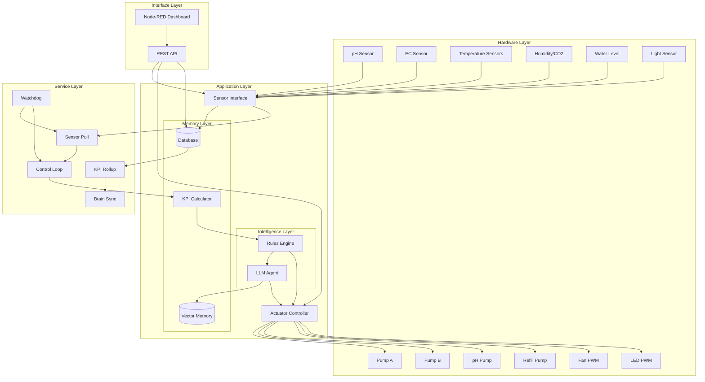
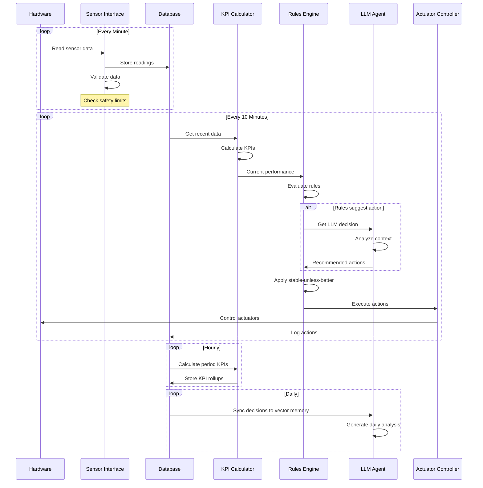
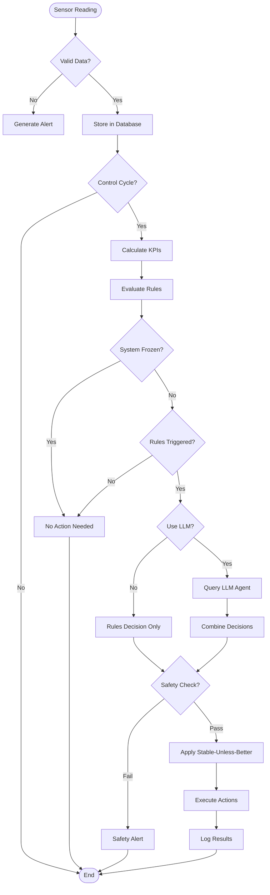
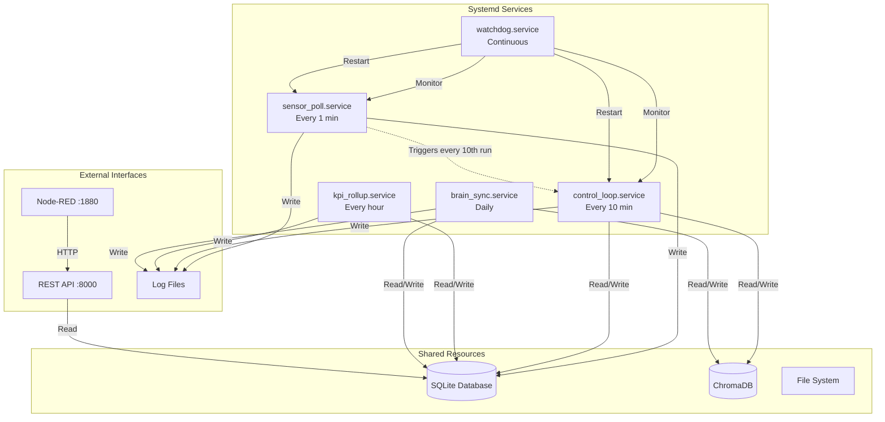
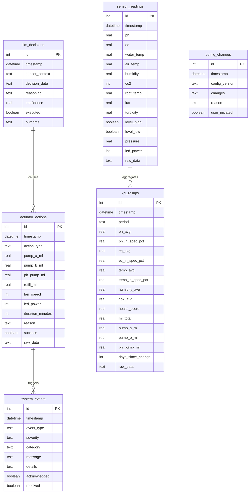
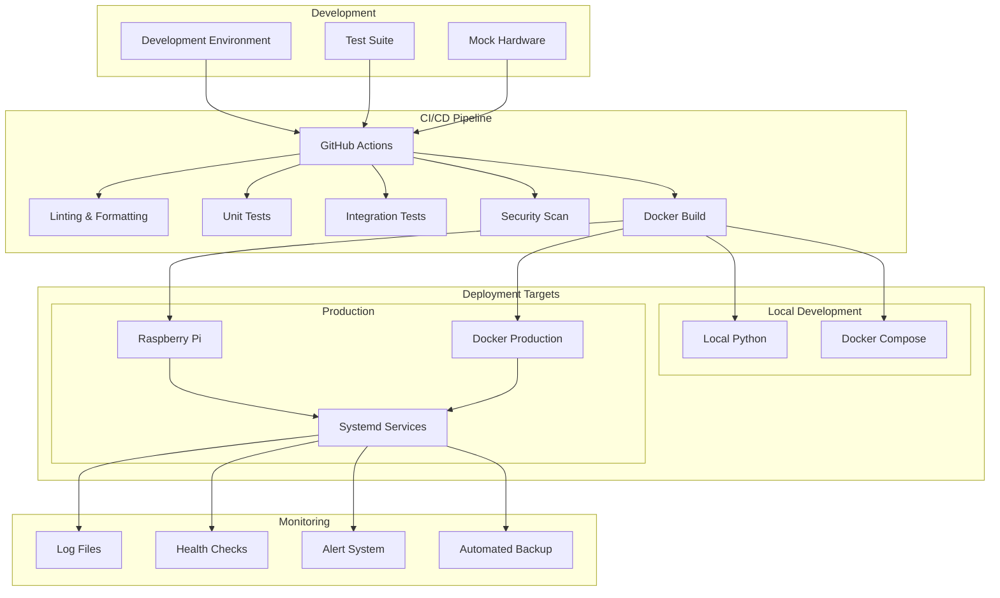

# System Architecture Diagrams

## Overall System Architecture



## Data Flow Diagram



## Control Logic Flow



## Service Interaction Diagram



## Database Schema Diagram



## Hardware Connection Diagram

```mermaid
graph LR
    subgraph "Raspberry Pi Zero 2 W"
        subgraph "GPIO Pins"
            GPIO17[GPIO 17 - Pump A]
            GPIO27[GPIO 27 - Pump B]
            GPIO22[GPIO 22 - pH Pump]
            GPIO25[GPIO 25 - Refill]
            GPIO18[GPIO 18 - Fan PWM]
            GPIO13[GPIO 13 - LED PWM]
            GPIO23[GPIO 23 - Float Hi]
            GPIO24[GPIO 24 - Float Lo]
            GPIO4[GPIO 4 - 1-Wire]
        end
        
        subgraph "I2C Bus"
            I2C[SDA/SCL]
        end
        
        subgraph "UART"
            UART[RX/TX]
        end
    end
    
    subgraph "Sensors"
        ADS[ADS1115 ADC<br/>0x48]
        BME[BME280<br/>0x76]
        DS18[DS18B20<br/>1-Wire]
        CO2[MH-Z19B<br/>UART]
        FH[Float High]
        FL[Float Low]
    end
    
    subgraph "Sensor Probes"
        PH[pH Probe]
        EC[EC Probe]
        TURB[Turbidity Sensor]
        LUX[Light Sensor]
    end
    
    subgraph "Actuators"
        PA[Pump A Relay]
        PB[Pump B Relay]
        PPH[pH Pump Relay]
        PR[Refill Pump Relay]
        FAN[Fan Controller]
        LED[LED Driver]
    end
    
    I2C --- ADS
    I2C --- BME
    GPIO4 --- DS18
    UART --- CO2
    GPIO23 --- FH
    GPIO24 --- FL
    
    ADS --- PH
    ADS --- EC
    ADS --- TURB
    ADS --- LUX
    
    GPIO17 --- PA
    GPIO27 --- PB
    GPIO22 --- PPH
    GPIO25 --- PR
    GPIO18 --- FAN
    GPIO13 --- LED
```

## Deployment Architecture

